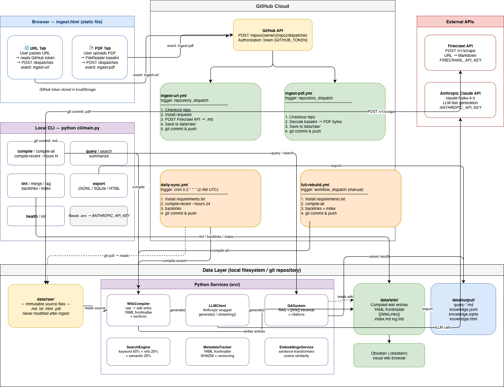

# LLM Knowledge Base

Transform your research materials into an intelligent, queryable knowledge base powered by Claude AI.

A **CLI-first** project that implements [Karpathy's LLM Wiki Pattern](https://gist.github.com/karpathy/442a6bf555914893e9891c11519de94f): raw sources incrementally compile into a structured, interlinked wiki. Knowledge compounds over time.



## 🎯 Features

- **Data Ingestion**: Add raw documents (articles, PDFs, papers, etc.) to `data/raw/`
- **LLM-Powered Compilation**: Automatically convert raw documents into structured wiki articles using Claude AI
- **Auto-Tagging**: Claude analyzes each article to suggest 3-5 relevant tags for organization
- **Wiki Linking**: Automatic `[[topic]]` backlinks and bidirectional article connections
- **Forward Links**: Automatically write "Referenced by" sections into linked articles
- **Smart Traversal**: During Q&A, follow `[[links]]` to enrich context with related articles
- **Connection Strength**: Weight search results by reference count + optional semantic similarity
- **Intelligent Search**: Keyword indexing + reference count + optional semantic embeddings
- **Q&A System**: Ask complex questions and get research-based answers with enriched context
- **Duplicate Detection**: Find and merge duplicate articles
- **Update Tracking**: Detect when source files change; track versions and compilation history
- **Multi-Format Exports**: Export knowledge base as JSONL, SQLite, HTML, JSON-LD
- **Interactive HTML Export**: Generate modern accordion-style HTML with tags, summaries, and responsive design
- **Static HTML Output**: Generate shareable, standalone HTML for GitHub Pages or static hosting
- **CLI-Only**: Command-line tools (no web UI or backend API)

## 🚀 Quick Start

### Prerequisites

- Python 3.9+
- Anthropic API key (get one at [console.anthropic.com](https://console.anthropic.com))

### Installation

```bash
# Clone and navigate to project
cd llm-knowledge-base

# Create virtual environment
python -m venv venv
source venv/bin/activate  # On Windows: venv\Scripts\activate

# Install dependencies
pip install -r requirements.txt

# Configure environment
cp .env.example .env
# Edit .env and add your ANTHROPIC_API_KEY
```

### Your First Knowledge Base

```bash
# Initialize directories
python cli/main.py init

# Add some raw documents to data/raw/
# (Create .txt, .md, .pdf files)

# Compile all documents
python cli/main.py compile-all

# Search your knowledge base
python cli/main.py search "topic"

# Ask a question
python cli/main.py query "What are the key concepts?"

# Export for sharing or GitHub Pages
python cli/main.py export --formats all
```

## 📖 CLI Reference

All operations run via the CLI. No backend API or web UI required.

```bash
python cli/main.py --help
```

### Core Commands

#### **Document Compilation**

```bash
# Compile a single raw document
python cli/main.py compile data/raw/paper.pdf --title "Research Paper"

# Compile all raw documents (auto-applies forward links)
python cli/main.py compile-all

# Update forward links ("Referenced by" sections)
python cli/main.py backlinks
```

#### **Searching & Querying**

```bash
# Search wiki by keyword (ranked by relevance + reference count)
python cli/main.py search "machine learning" --limit 10

# Ask a question (follows [[links]] by default for context enrichment)
python cli/main.py query "What are transformers?"

# Disable link traversal if needed
python cli/main.py query "Explain backpropagation" --follow-links false

# Summarize a topic
python cli/main.py summarize "neural networks"
```

#### **Tagging & Organization**

```bash
# Auto-generate tags for all articles using Claude analysis
python cli/main.py tag

# Result: Each article gets 3-5 relevant tags in its frontmatter
# Suggests running 'python cli/main.py index' after tagging
```

#### **Maintenance & Linting**

```bash
# Check system health
python cli/main.py health

# Find potential duplicate articles
python cli/main.py lint --find-duplicates

# Find articles with outdated sources
python cli/main.py lint --find-stale

# Merge two articles (source → target)
python cli/main.py merge neural-networks.md deep-learning.md --strategy append
```

#### **Exporting**

```bash
# Export to HTML for static sharing
python cli/main.py export --formats html

# Export to all formats (JSONL, SQLite, HTML, JSON-LD)
python cli/main.py export --formats all

# Export to JSON for training/bulk processing
python cli/main.py export --formats jsonl

# Export to SQLite for offline search
python cli/main.py export --formats sqlite
```

#### **Wiki Management**

```bash
# Generate/update wiki index
python cli/main.py index

# Initialize directories (run once)
python cli/main.py init
```

## 📁 Directory Structure

```
llm-knowledge-base/
├── src/
│   ├── core/
│   │   ├── config.py         # Settings & environment
│   │   ├── llm.py            # Claude API client
│   │   └── search.py         # Search engine
│   └── services/
│       ├── wiki_compiler.py      # Raw → Wiki conversion
│       ├── qa_system.py          # Q&A with LLM
│       ├── export.py             # Multi-format export
│       ├── embeddings.py         # Optional semantic search
│       ├── duplicate_detector.py # Find duplicates
│       ├── wiki_merger.py        # Merge articles
│       ├── tagger.py             # Auto-tag articles
│       └── ... (other services)
├── cli/
│   └── main.py                   # CLI entry point (Typer)
├── data/
│   ├── raw/                      # Raw source documents (you add these)
│   ├── wiki/                     # Compiled wiki articles (auto-generated)
│   └── output/                   # Exports & query results
├── tests/
├── pyproject.toml                # Python packaging config
├── requirements.txt              # Dependencies
└── README.md                     # This file
```

**Key Points:**
- `src/core/` & `src/services/` — Core modules and processing logic
- `cli/main.py` — CLI entry point (run with `python cli/main.py`)
- `data/` — Persistent knowledge (version controlled, portable)
- No backend server, no web UI, no API

## 🏗️ Architecture

### How It Works

```
Raw Documents (data/raw/)
    ↓
[Wiki Compiler] — LLM processes & structures + generates [[links]]
    ↓
[Metadata Tracker] — Hash & timestamp tracking
    ↓
Structured Wiki (data/wiki/) + YAML Frontmatter
    ↓
[Forward Linker] — Writes "Referenced by" sections
    ↓
[Duplicate Detector] — Find overlapping articles
[Update Detector] — Find stale articles
[Wiki Merger] — Merge duplicates
    ↓
[Search Engine] — Indexes with connection strength
  • Keyword scoring
  • Reference count (backlinks)
  • Semantic similarity (optional)
    ↓
[Q&A System] — Smart traversal
  • Search relevant docs
  • Follow [[links]] for enriched context
  • Pass to LLM
    ↓
[Export Service]
  • JSONL (training data)
  • SQLite (offline search)
  • HTML (static web sharing)
  • JSON-LD (structured metadata)
```

### Core Components

| Component | Purpose | Key Files |
|-----------|---------|-----------|
| **LLM Client** | Interface with Claude API | `src/core/llm.py` |
| **Wiki Compiler** | Raw → Wiki conversion + link generation | `src/services/wiki_compiler.py` |
| **Wiki Tagger** | Auto-generate tags for articles using Claude | `src/services/tagger.py` |
| **Search Engine** | Keyword + connection strength + semantic ranking | `src/core/search.py` |
| **Q&A System** | Context retrieval + link traversal + LLM response | `src/services/qa_system.py` |
| **Export Service** | Multi-format output (JSONL, SQLite, HTML, JSON-LD) | `src/services/export.py` |
| **Embeddings** | Optional semantic search (sentence-transformers) | `src/services/embeddings.py` |
| **Duplicate Detector** | Find overlapping articles | `src/services/duplicate_detector.py` |
| **Wiki Merger** | Merge articles with strategy selection | `src/services/wiki_merger.py` |
| **Metadata Tracker** | Track versions, hashes, compilation history | `src/services/metadata_tracker.py` |

## 🔗 Article Connections

Articles are linked bidirectionally using Markdown's `[[topic]]` syntax:

### 1. **Forward Linking** (Writing)
- During compilation, Claude generates `[[topic]]` links in article text
- `backlinks` command scans all articles and writes "Referenced by" sections
- Each linked article automatically lists which articles reference it
- **Automatic after** `compile-all`

### 2. **Smart Traversal** (Reading)
- During Q&A queries, the system extracts `[[links]]` from matched articles
- Related articles are fetched automatically (1 hop depth)
- Enriches LLM context without hallucination
- **Enabled by default** (disable with `--follow-links false`)

### 3. **Connection Strength** (Ranking)
- Articles referenced by many others rank higher in search results
- Optional semantic similarity scoring (requires embeddings)
- Formula: `0.6×keyword + 0.2×reference_count + 0.2×semantic`
- **Prevents** obscure or tangential articles from dominating results

### Example Workflow

```bash
# Step 1: Compile with auto-linking
python cli/main.py compile-all
# → Wiki articles now have "Referenced by" sections

# Step 2: Search shows well-connected articles first
python cli/main.py search "attention mechanism"
# → "Transformer" ranks high (many articles reference it)

# Step 3: Query follows links for richer context
python cli/main.py query "How does self-attention work?"
# → Pulls related: [[Transformer]], [[Dot-Product Attention]], [[Multi-Head Attention]]

# Step 4: Export for sharing
python cli/main.py export --formats html
# → Generate knowledge.html for GitHub Pages
```

## 📚 Article Frontmatter & Tagging

Each compiled article includes YAML metadata:

```yaml
---
title: Transformer Architecture
source_file: data/raw/attention-is-all-you-need.pdf
source_hash: abc123def456...
compiled_at: 2026-04-16T21:30:00
version: 3
tags: ["Neural Networks", "Architecture", "Deep Learning", "Attention Mechanism", "Transformer"]
related_topics: [Attention, Self-Attention, Multi-Head Attention]
backlinked_by: [bert.md, gpt.md, transformer-xl.md]
---
```

### Auto-Tagging

After compiling articles, run the auto-tagging command:

```bash
python cli/main.py tag
```

Claude analyzes each article and suggests 3-5 relevant tags. Tags are:
- Automatically extracted from article content
- Used to organize the HTML export into collapsible accordion sections
- Displayed with article counts in the knowledge base interface
- Condensed to primary tags only (no duplicate categories)

**Fields:**
- `tags` — Auto-generated tags for article organization and discovery
- `source_hash` — SHA256 of original raw file (detect updates)
- `version` — Compilation counter (increment on each recompile)
- `backlinked_by` — Articles that link to this one
- `related_topics` — Topics mentioned in the article

## ⚙️ Configuration

### Environment Variables (`.env`)

```env
ANTHROPIC_API_KEY=sk-...                    # Required
MODEL=claude-haiku-4-5-20251001             # LLM to use
MAX_TOKENS=4096                             # Max response length
TEMPERATURE=0.7                             # Creativity (0-1)
DEBUG=false                                 # Enable debug logging
```

### Optional Dependencies

**Semantic Search (Embeddings)**
```bash
pip install sentence-transformers torch transformers
```

Impact on search ranking:
- **Without**: `0.6×keyword + 0.4×reference_count`
- **With**: `0.6×keyword + 0.2×reference_count + 0.2×semantic`

Falls back gracefully if not installed.

## 🔄 Workflow Examples

### Personal Research Wiki

```bash
# 1. Add research papers, articles, notes to data/raw/
cp ~/Downloads/paper.pdf data/raw/
cp ~/Documents/notes.md data/raw/

# 2. Compile everything
python cli/main.py compile-all

# 3. Auto-tag articles for organization
python cli/main.py tag

# 4. Regenerate index with categories
python cli/main.py index

# 5. Ask synthesis questions
python cli/main.py query "What are the key findings across all papers?"

# 6. Export for sharing
python cli/main.py export --formats html

# 7. Output saved to data/output/ (review & share)
cat data/output/query-0.md
```

### Documentation Generator

```bash
# 1. Organize docs in data/raw/
data/raw/
  ├── api-reference.md
  ├── getting-started.md
  └── examples/

# 2. Compile and export
python cli/main.py compile-all
python cli/main.py export --formats html

# 3. Deploy data/output/knowledge.html to GitHub Pages
cp data/output/knowledge.html docs/index.html
git add docs/index.html && git commit -m "Update docs"
git push origin main
```

### Knowledge Synthesis

```bash
# 1. Load multiple sources on a topic
python cli/main.py compile-all

# 2. Identify patterns
python cli/main.py summarize "machine learning trends"

# 3. Discover connections
python cli/main.py query "Which concepts appear in multiple sources?"

# 4. Let LLM fill gaps
python cli/main.py query "What's the relationship between X and Y?"
```

## 🔍 Maintenance

### Check System Health

```bash
python cli/main.py health
```

Output:
```
                System Health                
┏━━━━━━━━━━━━━━━┳━━━━━━━━━━━━━━━━━━━━━━━━━━━┓
│ Wiki Articles │ 51                        │
│ Raw Documents │ 59                        │
│ API Key Set   │ ✓                         │
│ Model         │ claude-haiku-4-5-20251001 │
└───────────────┴───────────────────────────┘
```

### Find & Merge Duplicates

```bash
# Detect overlapping articles
python cli/main.py lint --find-duplicates

# Merge source into target
python cli/main.py merge source.md target.md --strategy append

# Strategies: append, prepend, section
# Original article archived to data/wiki/.archives/
```

### Update Stale Articles

```bash
# Find articles with outdated sources
python cli/main.py lint --find-stale

# Recompile to refresh
python cli/main.py compile-all
```

## 📤 Sharing & Deployment

### Generate Static HTML

```bash
python cli/main.py export --formats html

# Output: data/output/knowledge.html
# Features:
#   - Modern accordion interface with collapsible categories
#   - Organized by auto-generated tags
#   - Article summaries (first meaningful paragraph)
#   - Word count for each article
#   - Responsive design with gradient headers
#   - Statistics: Total articles, word count, category count
#   - Smooth hover animations and interactions
#   - Standalone HTML (no external dependencies)
```

### Deploy to GitHub Pages

```bash
# 1. Export HTML
python cli/main.py export --formats html

# 2. Configure GitHub Pages in repo settings
#    → Build and deployment → Source → GitHub Actions

# 3. Create .github/workflows/pages.yml
#    (Already configured in this project)

# 4. Commit & push
git add data/output/knowledge.html
git commit -m "Update knowledge base export"
git push origin main
```

GitHub Actions automatically:
- Runs `python cli/main.py export --formats all`
- Uploads `data/output/` to GitHub Pages
- Skips builds when only `data/raw/` changes

### Other Export Formats

```bash
# JSONL (one JSON object per line)
python cli/main.py export --formats jsonl
# Use case: Training data, bulk import, AI model fine-tuning

# SQLite (full-text search indexed)
python cli/main.py export --formats sqlite
# Use case: Offline search, portable, application integration

# JSON-LD (structured metadata)
python cli/main.py export --formats metadata
# Use case: SEO, search engine discovery, linked data
```

## ❓ FAQ

**Q: How do I add content to my knowledge base?**
A: Add files to `data/raw/` (supports `.md`, `.txt`, `.pdf`). Run `compile-all` to process.

**Q: Which LLM models are supported?**
A: Currently Anthropic Claude. Modify `src/llm_knowledge_base/core/llm.py` for other providers.

**Q: How do I know if my wiki is up-to-date?**
A: Run `lint --find-stale` to check for articles whose source files have changed.

**Q: Can I use embeddings/semantic search?**
A: Yes, optional. Install `sentence-transformers` for semantic ranking. System gracefully falls back to keyword + reference count.

**Q: How do I visualize article connections?**
A: The `[[wiki-links]]` notation works with Obsidian, Foam, and other tools. Open `data/wiki/` as a vault/workspace.

**Q: Can I disable link traversal in queries?**
A: Yes, use `--follow-links false`:
```bash
python cli/main.py query "..." --follow-links false
```

**Q: How often should I recompile?**
A: After adding/updating files in `data/raw/`. Recompilation updates metadata, detects changes, and regenerates links.

**Q: What's the difference between `search` and `query`?**
A: 
- `search` — Keyword lookup, returns ranked articles
- `query` — Natural language question, returns AI-generated answer with sources

**Q: How large can my knowledge base be?**
A: No hard limits. System scales to hundreds of articles. Performance depends on model and embedding setup.

## 🛠️ Development

### Project Structure (Python Best Practices)

This project uses the [modern Python `src/` layout](https://packaging.python.org/en/latest/discussions/src-layout-vs-flat-layout/) recommended by PyPA:

- **Separation of concerns**: Code in `src/`, data in `data/`
- **Testing**: Imports test the installed package, not the source directory
- **Distribution-ready**: Can be published to PyPI or used as a library
- **Clear entry point**: `cli/main.py` is the only public interface

### Running Tests

```bash
pytest tests/
```

### Code Style

```bash
# Format code
black src/ cli/

# Lint
ruff check src/ cli/

# Type checking
mypy src/
```

Configure these in `pyproject.toml`.

### Adding New CLI Commands

Commands live in `cli/main.py` using [Typer](https://typer.tiangolo.com/):

```python
@app.command()
def my_command(arg: str = typer.Argument(..., help="Description")):
    """Command description"""
    try:
        # Your code here
        console.print("[green]✓ Success![/green]")
    except Exception as e:
        console.print(f"[red]✗ Error: {e}[/red]")
        raise typer.Exit(1)
```

## 📝 License

MIT

## 🤝 Contributing

Contributions welcome! This is an open system designed to be extended.

### Ideas for Contribution

- [ ] Add support for additional document formats (XML, JSON, PPTX)
- [ ] Implement graph visualization of article connections
- [ ] Add multi-hop link traversal (currently 1-hop)
- [ ] Create Obsidian plugin for tighter integration
- [ ] Add git integration for version history
- [ ] Implement incremental compilation (only changed files)
- [ ] Add support for other LLM providers

## 📚 Related Resources

- [Karpathy's LLM Wiki Pattern](https://gist.github.com/karpathy/442a6bf555914893e9891c11519de94f) — Conceptual foundation
- [Python Packaging Guide](https://packaging.python.org/) — PEP 517/518 standards
- [Typer Documentation](https://typer.tiangolo.com/) — CLI framework
- [Anthropic Claude API](https://docs.anthropic.com/claude/reference/getting-started-with-the-api) — LLM backend

## 🚀 Roadmap

### Currently Implemented ✅
- Auto-tagging with Claude analysis (3-5 tags per article)
- Multi-format exports (JSONL, SQLite, HTML, JSON-LD)
- Modern accordion-style HTML interface with tag organization
- Article summaries in HTML export
- Optional semantic search with embeddings
- Duplicate detection & merging
- Update tracking & version management
- Forward linking (automatic "Referenced by" sections)
- Smart traversal (follow [[links]] for context enrichment)
- Connection strength ranking (reference count + semantic)
- GitHub Pages deployment via Actions
- CLI-first architecture

### Future Ideas 🔮
- Git integration for article history
- Multi-hop link traversal
- Link pruning/deweighting (avoid over-expansion)
- Temporal link weighting (recent links matter more)
- LLM-powered conflict resolution for merges
- Graph visualization dashboard
- Multi-way merge support
- Incremental compilation
- Additional LLM providers
